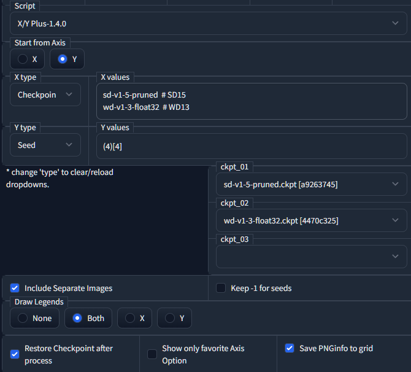

# X/Y Plus



- X/Y plot の機能追加版
- Extension/Custom script for [AUTOMATIC1111's Stable Diffusion Web UI](https://github.com/AUTOMATIC1111/stable-diffusion-webui)

## 機能

### X-Y の実行順序を選択: Radio


### 実行後に Checkpoint を元に戻す: Checkbox

### X-Y Grid に表示される Checkpoint 名について、別名を表示する: Enabled

- "Checkpoint Name" を選択

- x_type または y_type に Checkpoint Name を入力

- `#` 以降に、別名を入力
  
  ```
  sd-v1.4 # SD14
  wd-v1.3 # WD13
  ```

|  |  |
| -------------------------- | -------------------------- |

### 保存される grid の PNG ファイルに、seed などの PNG Info 情報を追加できる: Enabled

### X/Y の選択肢について、(私が)よく使うものだけを表示する: Checkbox


- Seed
- Steps
- Samplers
- CFG Scale
- Prompt S/R
- Checkpoint name
- Hypernetwork
- Checkpoint Dropdown

### 数値入力について、より柔軟な range, step 入力に対応

- seed and step and range
   - `   123 ( 4 ) [ 5 ] "  => "123, 127, 131, 135, 139`
   - ` - 123 ( 4 ) [ 5 ] "  => "123, 119, 115, 111, 107`
- seed and range
   - `   123 [ 5 ] "        => "123, 124, 125, 126, 127`
   - ` - 123 [ 5 ] "        => "123, 122, 121, 120, 119`
- step and range
   - seed値は、デフォルトUIにある Seed 項の値を参照します
      - `   ( 4 ) [ 5 ] "      => "<seed>, <>+4, <>+8, <>+12, <>+16`
      - ` - ( 4 ) [ 5 ] "      => "<seed>, <>-4, <>-8, <>-12, <>-16`
- range
   - seed値は、デフォルトUIにある Seed 項の値を参照します
      - `   [ 5 ] "            => "<seed>, +1, +2, +3, +4`
      - ` - [ 5 ] "            => "<seed>, -1, -2, -3, -4`

### 新しい Axis Option を追加 "Checkpoint Dropdown": checkpoint を dropdown から選択して追加

|                      |                                                                                       |
| -------------------- | ------------------------------------------------------------------------------------- |
|  | "Checkpoint Dropdown" を X type or Y type で選ぶと, Checkpoint 追加のための dropdown が新たに表示されます. |
|  | 追加の dropdown で、checkpoint を選択できます<br/>選択した Checkpoint の名前が、"Values" の値に追加されます         |
|  | 上記の "checkpoint に表示用の別名をつける" 機能も有効です.                                                 |
|                      | 追加用Dropdown は 10 個まで表示されます.                                                           |

### 出力する Grid のタイトルを付与する Axis を選択


| Setting | Result               |
| ------- | -------------------- |
| None    | no legends           |
| Both    |  |
| X       |  |
| Y       |  |
