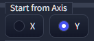
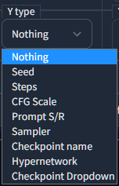

# X/Y Plus


- This is Extension/Custom script for [AUTOMATIC1111's Stable Diffusion Web UI](https://github.com/AUTOMATIC1111/stable-diffusion-webui)
- Add function to original X/Y plot

## Features

### Selectable process order: X or Y




### Restore Checkpoint after process: Checkbox

### Allow to add other name for checkpoint, which is used in Grid legends

- Use # and add other name
  
  ```
  sd-v1-5-pruned # SD15
  wd-v1-3-float32 # WD13
  ```

|  |  |
| -------------------------- | -------------------------- |

### Allow to add PNGInfo to grid png: Checkbox

### Allow to show Axis option of "my" favorite



- Seed

- Steps

- CFG Scale

- Prompt S/R

- Checkpoint name

- Hypernetwork

### Allow input seed number in other rule

- seed and step and range
   - `"   123 ( 4 ) [ 5 ] "  => "123, 127, 131, 135, 139"`
   - `" - 123 ( 4 ) [ 5 ] "  => "123, 119, 115, 111, 107"`
- seed and range
   - `"   123 [ 5 ] "        => "123, 124, 125, 126, 127"`
   - `" - 123 [ 5 ] "        => "123, 122, 121, 120, 119"`
- step and range
   - `"   ( 4 ) [ 5 ] "      => "<seed>, <>+4, <>+8, <>+12, <>+16"`
   - `" - ( 4 ) [ 5 ] "      => "<seed>, <>-4, <>-8, <>-12, <>-16"`
- range
   - `"   [ 5 ] "            => "<seed>, +1, +2, +3, +4"`
   - `" - [ 5 ] "            => "<seed>, -1, -2, -3, -4"`
