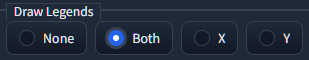

# X/Y Plus


- This is Extension/Custom script for [AUTOMATIC1111's Stable Diffusion Web UI](https://github.com/AUTOMATIC1111/stable-diffusion-webui)
- Add function to original X/Y plot

## Features

### Selectable process order: X or Y


### Restore Checkpoint after process: Checkbox

### Allow to add other name for checkpoint, which is used in Grid legends

- Use # and add other name
  
  ```
  sd-v1-5-pruned # SD15
  wd-v1-3-float32 # WD13
  ```

|  |  |
| -------------------------- | -------------------------- |

### Allow to add PNGInfo to grid png: Checkbox

### Allow to show Axis option of "my" favorite


- Seed
- Steps
- Samplers
- CFG Scale
- Prompt S/R
- Checkpoint name
- Hypernetwork
- Checkpoint Dropdown

### Allow input number in other rule

- seed and step and range
   - `"   123 ( 4 ) [ 5 ] "  => "123, 127, 131, 135, 139"`
   - `" - 123 ( 4 ) [ 5 ] "  => "123, 119, 115, 111, 107"`
- seed and range
   - `"   123 [ 5 ] "        => "123, 124, 125, 126, 127"`
   - `" - 123 [ 5 ] "        => "123, 122, 121, 120, 119"`
- step and range
   - `"   ( 4 ) [ 5 ] "      => "<seed>, <>+4, <>+8, <>+12, <>+16"`
   - `" - ( 4 ) [ 5 ] "      => "<seed>, <>-4, <>-8, <>-12, <>-16"`
- range
   - `"   [ 5 ] "            => "<seed>, +1, +2, +3, +4"`
   - `" - [ 5 ] "            => "<seed>, -1, -2, -3, -4"`

### New Axis Option "Checkpoint Dropdown": Allow to choose Checkpoint by Dropdown

|                      |                                                                                                                                 |
| -------------------- | ------------------------------------------------------------------------------------------------------------------------------- |
|  | Select "Checkpoint Dropdown" on X type or Y type, additional dropdown appears.                                                  |
|  | On additinal dropdown, you can select Checkpoint as dropdown.<br/>Selected checkpoint name is inputed to "Values" field as text |
|  | "Other name for checkpoint" feature still alive.                                                                                |
|                      |                                                                                                                                 |

### Allow select "Draw Legend" on "Both" or "X" or "Y"



| Setting | Result               |
| ------- | -------------------- |
| None    | no legends           |
| Both    |  |
| X       |  |
| Y       |  |
